# 01 — Teoria do Pseudo-3D

> Fontes: [Lou's Pseudo-3D Page](https://www.extentofthejam.com/pseudo/), [v1 — Straight](https://jakesgordon.com/writing/javascript-racer-v1-straight/)

Antes de entrar no código, vale entender de onde vem a técnica. Jogos de corrida de arcade dos
anos 80 (Pole Position, Out Run) precisavam simular uma pista 3D em hardware incapaz de
renderizar polígonos 3D de verdade. A solução: **pseudo-3D** — uma pista construída inteiramente
com truques 2D que *parecem* 3D.

## 1.1 A ideia central: projeção em perspectiva

A perspectiva em que objetos distantes parecem menores e mais próximos do horizonte é regida pela
**lei dos triângulos semelhantes**. Um ponto no mundo com altura `y` e profundidade (distância da
câmera) `z` projeta-se na tela em:

```
y_tela = (y_mundo * d) / z_mundo + (altura_tela / 2)
x_tela = (x_mundo * d) / z_mundo + (largura_tela / 2)
```

onde `d` é a distância da câmera até o "plano de projeção" (a tela virtual). O fator comum aos
dois eixos é **`d/z`** — chamado de **escala** (`scale`). Quanto maior o `z` (mais longe), menor a
escala; a 45 graus de distância a estrada e os objetos ficam minúsculos; perto da câmera, a escala
tende a ser grande. Esse único número, `escala = d/z`, é reaproveitado para:

- posicionar X e Y na tela,
- calcular a largura da estrada projetada naquele ponto,
- escalar o tamanho dos sprites (árvores, placas, carros) para que fiquem coerentes com a
  distância.

<p align="center">

<br/><em>Figura 1 — o raio de visão da câmera até o ponto P no mundo cruza o plano de projeção em
y_tela. Os dois triângulos (câmera→plano, câmera→P) são semelhantes, daí a proporção
y_tela/d = y_mundo/z_mundo.</em>
</p>

Na página de Lou (`extentofthejam.com/pseudo`), a técnica de arcade clássica é descrita em termos
de uma **tabela pré-computada** que associa cada linha de tela a uma distância Z (o "Z-map"),
evitando dividir em tempo real (`y/z`) em hardware de 8-bit — cada linha da tela já "sabe" a que
distância ela corresponde, assumindo um plano de chão perfeitamente horizontal. Esse era o
truque essencial das placas de arcade: pré-computar tudo o que pudesse ser pré-computado e reduzir
o resto a somas/incrementos por scanline.

O JavaScript Racer, rodando em um PC moderno com Canvas 2D, não precisa dessa otimização (pode
calcular `d/z` em ponto flutuante a cada frame sem se preocupar com desempenho de CPU dos anos 80),
mas herda a mesma formulação matemática.

## 1.2 Três etapas formais: tradução → projeção → escalamento

O artigo da v1 formaliza o pipeline de projeção em três passos:

1. **Tradução** — converter coordenadas do *mundo* (fixas, absolutas) para coordenadas relativas à
   *câmera* (subtraindo a posição da câmera).
2. **Projeção** — projetar as coordenadas da câmera num plano de projeção normalizado usando o
   fator `d/z`.
3. **Escalamento** — converter a projeção normalizada em pixels físicos de tela (multiplicando por
   `largura/2` e `altura/2`, e somando o centro da tela).

A observação importante do autor: *"em um sistema 3D completo, uma etapa de rotação entraria entre
os passos 1 e 2"* — ou seja, entre traduzir para o espaço da câmera e projetar, normalmente você
giraria a cena de acordo com a orientação da câmera. Como este jogo **nunca gira a câmera de
verdade** (curvas são simuladas de outra forma — ver [03 — Curvas](03-v2-curvas.md)), essa etapa é
simplesmente omitida. Essa é a essência do "pseudo" em pseudo-3D: pega-se emprestada a matemática
de projeção 3D, mas descarta-se a parte mais cara (rotação/matriz de câmera completa) porque o
mundo do jogo é, na prática, quase-plano e a câmera sempre olha para frente.

As três etapas acima mapeiam diretamente para a função `Util.project` em `common.js` — ver
[06 — Arquitetura de common.js](06-arquitetura-common-js.md#utilproject) para a implementação linha
a linha.

<p align="center">

<br/><em>Figura 2 — o pipeline de projeção implementado por <code>Util.project</code>: cada ponto de
um segmento passa por tradução, projeção e escalamento, sem nenhuma etapa de rotação.</em>
</p>

## 1.3 Campo de visão (field of view) e distância de projeção `d`

Um parâmetro configurável e intuitivo para o jogador é o **campo de visão** em graus
(`fieldOfView`), não a distância abstrata `d`. A conversão entre os dois vem da trigonometria do
triângulo formado entre a câmera, o plano de projeção e a metade da abertura do campo de visão:

```
d = 1 / tan(fov / 2)
```

Isso é literalmente o que o código faz (em cada versão, dentro de `reset()`):

```javascript
cameraDepth = 1 / Math.tan((fieldOfView/2) * Math.PI/180);
```

Quanto **maior** o campo de visão (mais graus), **menor** `d` — a câmera "enxerga" mais dos lados
mas cada unidade de profundidade ocupa menos espaço de tela (efeito "grande angular"). Quanto
**menor** o campo de visão, **maior** `d` — efeito "teleobjetiva/zoom".

<p align="center">

<br/><em>Figura 3 — o ângulo do campo de visão (fov) e a distância d até o plano de projeção formam
um triângulo retângulo: tan(fov/2) = 1/d, logo d = 1/tan(fov/2).</em>
</p>

## 1.4 Segmentos de estrada em vez de um piso contínuo

Em vez de renderizar a pista como uma superfície contínua, a técnica clássica (e a deste projeto)
divide a estrada em **segmentos** — fatias de comprimento fixo no eixo Z (`segmentLength`, 200
unidades neste projeto). Cada segmento é, na prática, um trapézio desenhado entre duas bordas:

- **`p1`** — a borda do segmento mais próxima da câmera (ou seja, com `z` menor)
- **`p2`** — a borda mais distante (`z` maior)

Cada borda carrega três sub-objetos que representam a mesma etapa em estágios diferentes da
projeção:

- **`world`** — coordenadas absolutas no mundo do jogo (`x`, `y`, `z`)
- **`camera`** — coordenadas relativas à câmera, após a etapa de tradução
- **`screen`** — coordenadas finais em pixels de tela, após projeção + escalamento

Renderizar a pista é, então, percorrer os segmentos do mais próximo (embaixo da tela) ao mais
distante (`drawDistance` segmentos à frente), projetar `p1` e `p2` de cada um, e desenhar o
trapézio correspondente — depois de descartar segmentos atrás da câmera ou já cobertos por um
segmento anterior mais alto na tela (algoritmo de pintor simplificado, ver
[02 — V1](02-v1-estrada-reta.md#renderização-da-pista)).

<p align="center">

<br/><em>Figura 4 — cinco segmentos consecutivos, desenhados do mais próximo (base da tela, mais
largo) ao mais distante (topo, convergindo para a linha do horizonte). As faixas claras/escuras
alternadas vêm de <code>COLORS.LIGHT</code>/<code>COLORS.DARK</code>, e as faixas vermelhas nas
bordas são o "rumble strip".</em>
</p>

## 1.5 "Z-map" vs. projeção por segmento

A página de Lou descreve duas abordagens historicamente usadas:

1. **Raster puro com Z-map**: para cada linha de tela (de baixo para cima), consulta-se uma tabela
   pré-computada de distância Z, e desenha-se uma faixa horizontal da textura de estrada
   correspondente àquela distância. É rápida (sem multiplicação/divisão em tempo real) mas exige
   truques extras para curvas (deslocar `x` por linha) e colinas (variar o incremento do Z-map por
   linha, criando "warping" vertical — colinas falsas).
2. **Segmentos poligonais projetados** (a abordagem deste projeto e a mais fácil de entender): cada
   segmento é um "quad" (trapézio) com coordenadas 3D reais (`x`, `y`, `z`) que são projetadas
   matematicamente a cada frame. Curvas e colinas emergem naturalmente de variar `x` e `y` por
   segmento, sem exigir tabelas especiais — o mesmo código de projeção serve para estrada reta,
   curva e montanhosa.

<p align="center">

<br/><em>Figura 5 — à esquerda, a abordagem clássica de arcade: uma tabela pré-computada associa
cada linha de tela a uma distância Z fixa (rápido, mas exige truques extras para curvas/colinas).
À direita, a abordagem deste projeto: segmentos poligonais com coordenadas 3D reais, projetados
matematicamente a cada frame (mais caro, mas naturalmente suporta curvas e colinas).</em>
</p>

O JavaScript Racer usa a segunda abordagem. É mais lenta que a primeira (não seria viável em
hardware de 8-bit), mas em um PC moderno com Canvas 2D é perfeitamente viável e muito mais simples
de raciocinar — daí a progressão pedagógica do projeto: v1 (reta) → v2 (curvas, variando `x`) → v3
(colinas, variando `y`) → v4 (tudo junto + tráfego + sprites).

## 1.6 Fórmulas de curva e a progressão aritmética

A página de Lou descreve curvas clássicas como uma progressão aritmética: se cada linha de tela
desloca o centro da pista por um incremento `A` que cresce linearmente, o deslocamento acumulado
após `N` linhas é a soma de uma progressão aritmética:

```
deslocamento_final = ponto_inicial + A * [N(N+1)/2]
```

Esse é o motivo, explicado no artigo da v2, pelo qual uma curva é uma **equação de 2ª ordem**: o
deslocamento lateral (`x`) de um segmento distante depende da soma cumulativa das curvaturas de
todos os segmentos mais próximos — daí a necessidade de acumular tanto um deslocamento (`x`) quanto
sua taxa de variação (`dx`) durante a renderização, em vez de apenas somar curvaturas
individualmente. Ver [03 — V2: Curvas](03-v2-curvas.md#renderização-o-duplo-acumulador) para a
implementação exata.

<p align="center">

<br/><em>Figura 6 — para uma curvatura constante, a taxa acumulada <code>dx</code> cresce
linearmente com o número de segmentos percorridos, mas o deslocamento acumulado <code>x</code>
(a soma de todos os <code>dx</code> anteriores) cresce quadraticamente — daí a curva ser uma
equação de 2ª ordem.</em>
</p>

## 1.7 Otimizações históricas (contexto, não usadas literalmente aqui)

Vale registrar as otimizações que o hardware de arcade original usava, mesmo que o JavaScript
Racer não precise delas (CPUs modernas tornam a maioria irrelevante em pequena escala, mas ajudam
a entender por que a técnica é tão barata computacionalmente):

- **Evitar divisão em tempo real**: pré-computar `1/z` (o inverso da distância) e usar
  multiplicação em vez de divisão por linha de scanline.
- **Interpolação linear em ponto fixo**: `o(x) = y1 + ((d * (y2-y1)) >> 16)`, usando deslocamento
  de bits em vez de ponto flutuante.
- **Movimento de textura com aceleração quadrática simulada por somas**: em vez de calcular
  `posição = ½at²` a cada frame, incrementa-se uma velocidade (`dz += aceleração`) e depois a
  posição (`z += dz`) — uma integração numérica simples (Euler), muito barata.
- **Hardware dedicado (Sega Out Run)**: chips especializados armazenavam uma imagem de perspectiva
  inteira pré-renderizada em ROM de alta resolução (512×256) e o programa apenas selecionava, por
  scanline, qual linha da ROM copiar para a tela.

O JavaScript Racer troca todas essas otimizações de baixo nível por matemática direta em ponto
flutuante (`Util.project`, chamado uma vez por borda de segmento por frame), porque isso é
perfeitamente viável em um navegador atual e muito mais legível.

## 1.8 Resumo mental para os próximos capítulos

Tenha estes três fatos em mente ao ler os capítulos seguintes — eles explicam por que o código
consegue adicionar curvas e depois colinas quase sem tocar na função de renderização:

1. **`Util.project` já é genérica** desde a v1: ela aceita `cameraX`, `cameraY` e `cameraZ`
   arbitrários. A v1 sempre passa `cameraY = cameraHeight` fixo e nunca desloca `cameraX`; as
   versões seguintes só passam valores diferentes para esses mesmos parâmetros.
2. **Curvas = deslocar `cameraX` por segmento** (nunca há coordenada `x` real armazenada nos
   segmentos) — ver [03](03-v2-curvas.md).
3. **Colinas = dar aos segmentos uma coordenada `y` do mundo não-nula** — como `Util.project` já
   suportava `p.world.y`, a colina "simplesmente funciona" assim que os dados de altura existem —
   ver [04](04-v3-colinas.md).
