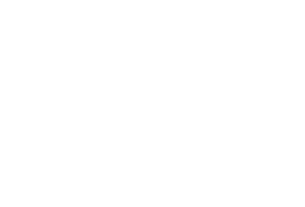

# 03 — V2: Curvas (`v2.curves.html`)

> Fonte teórica: [v2 — Curves](https://jakesgordon.com/writing/javascript-racer-v2-curves/)
> Arquivo: [`v2.curves.html`](../v2.curves.html)

A v2 parte da v1 (mesmo game loop, mesma projeção, mesma física longitudinal) e adiciona curvas.
A ideia-chave, citada no artigo a partir de Lou Yamtchuk: **"para curvar uma estrada, você só
precisa mudar a posição da linha central em formato de curva… começando no fundo da tela, a
quantidade que o centro da estrada se desloca para a esquerda ou direita aumenta continuamente"**.

Crucialmente: **em nenhum momento os segmentos ganham uma coordenada `x` real no mundo.** Diferente
de um motor 3D completo, não existe "estrada que serpenteia no espaço X". Em vez disso, a curva é
simulada inteiramente **durante a renderização**, deslocando repetidamente o parâmetro `cameraX`
passado para `Util.project` — como se a câmera estivesse constantemente "escorregando" de lado à
medida que olha para segmentos mais distantes. É uma ilusão puramente visual, mas funciona porque o
jogador nunca vê a pista de cima, só em primeira pessoa.

## 3.1 O valor `curve` por segmento

Cada segmento agora carrega um `curve`:

```javascript
function addSegment(curve) {
  var n = segments.length;
  segments.push({
     index: n,
        p1: { world: { z:  n   *segmentLength }, camera: {}, screen: {} },
        p2: { world: { z: (n+1)*segmentLength }, camera: {}, screen: {} },
     curve: curve,
     color: Math.floor(n/rumbleLength)%2 ? COLORS.DARK : COLORS.LIGHT
  });
}
```

Convenção de sinais:

- **negativo** → curva à esquerda
- **positivo** → curva à direita
- **magnitude maior** → curva mais fechada

As constantes de referência:

```javascript
var ROAD = {
  LENGTH: { NONE: 0, SHORT:  25, MEDIUM:  50, LONG:  100 },
  CURVE:  { NONE: 0, EASY:    2, MEDIUM:   4, HARD:    6 }
};
```

## 3.2 Curvas com entrada e saída suaves (easing)

Uma curva "crua" (mudar `curve` abruptamente de `0` para `4`) pareceria uma quina, não uma curva.
`addRoad` constrói uma curva em três fases: **entrada** (ease-in de 0 até a curvatura alvo),
**sustentação** (curvatura constante) e **saída** (ease-in-out de volta a 0):

```javascript
function addRoad(enter, hold, leave, curve) {
  var n;
  for(n = 0 ; n < enter ; n++)
    addSegment(Util.easeIn(0, curve, n/enter));
  for(n = 0 ; n < hold  ; n++)
    addSegment(curve);
  for(n = 0 ; n < leave ; n++)
    addSegment(Util.easeInOut(curve, 0, n/leave));
}
```

As funções de easing (definidas em `common.js`, ver [06](06-arquitetura-common-js.md#utileasein-easeout-easeinout)) são funções de interpolação não-linear entre dois valores `a` e `b`:

```javascript
easeIn:    function(a,b,percent) { return a + (b-a)*Math.pow(percent,2);                    },
easeInOut: function(a,b,percent) { return a + (b-a)*((-Math.cos(percent*Math.PI)/2) + 0.5); },
```

`easeIn` acelera a mudança progressivamente (começa devagar, termina rápido) — bom para *entrar*
numa curva sentindo o carro "puxar" gradualmente. `easeInOut` suaviza tanto o início quanto o fim
(como um S) — bom para transições que precisam começar e terminar suavemente, como a saída de uma
curva de volta à reta.

<p align="center">

<br/><em>Figura 10 — o valor de <code>curve</code> armazenado em cada segmento não salta
abruptamente: cresce em curva (ease-in) na entrada, fica constante na sustentação, e desce em "S"
(ease-in-out) na saída — daí a curva parecer suave ao dirigir por ela.</em>
</p>

## 3.3 Funções de conveniência para desenhar a pista

```javascript
function addStraight(num) {
  num = num || ROAD.LENGTH.MEDIUM;
  addRoad(num, num, num, 0);
}

function addCurve(num, curve) {
  num    = num    || ROAD.LENGTH.MEDIUM;
  curve  = curve  || ROAD.CURVE.MEDIUM;
  addRoad(num, num, num, curve);
}

function addSCurves() {
  addRoad(ROAD.LENGTH.MEDIUM, ROAD.LENGTH.MEDIUM, ROAD.LENGTH.MEDIUM,  -ROAD.CURVE.EASY);
  addRoad(ROAD.LENGTH.MEDIUM, ROAD.LENGTH.MEDIUM, ROAD.LENGTH.MEDIUM,   ROAD.CURVE.MEDIUM);
  addRoad(ROAD.LENGTH.MEDIUM, ROAD.LENGTH.MEDIUM, ROAD.LENGTH.MEDIUM,   ROAD.CURVE.EASY);
  addRoad(ROAD.LENGTH.MEDIUM, ROAD.LENGTH.MEDIUM, ROAD.LENGTH.MEDIUM,  -ROAD.CURVE.EASY);
  addRoad(ROAD.LENGTH.MEDIUM, ROAD.LENGTH.MEDIUM, ROAD.LENGTH.MEDIUM,  -ROAD.CURVE.MEDIUM);
}
```

E o traçado completo do circuito (`resetRoad`) vira uma "receita" legível, alternando retas, curvas
e S-curves:

```javascript
function resetRoad() {
  segments = [];
  addStraight(ROAD.LENGTH.SHORT/4);
  addSCurves();
  addStraight(ROAD.LENGTH.LONG);
  addCurve(ROAD.LENGTH.MEDIUM, ROAD.CURVE.MEDIUM);
  addCurve(ROAD.LENGTH.LONG, ROAD.CURVE.MEDIUM);
  addStraight();
  addSCurves();
  addCurve(ROAD.LENGTH.LONG, -ROAD.CURVE.MEDIUM);
  addCurve(ROAD.LENGTH.LONG, ROAD.CURVE.MEDIUM);
  addStraight();
  addSCurves();
  addCurve(ROAD.LENGTH.LONG, -ROAD.CURVE.EASY);
  // ... START/FINISH e trackLength, como na v1
}
```

Esse é o padrão de "DSL interna" (mini-linguagem embutida em JS) que se repete e cresce em v3 e v4:
funções pequenas e nomeadas compõem trechos de pista, e uma função "receita" (`resetRoad`) só
chama essas funções em sequência — o traçado do circuito fica legível como uma lista de instruções,
sem precisar editar coordenadas manualmente.

## 3.4 Força centrífuga em `update()`

```javascript
function update(dt) {

  var playerSegment = findSegment(position+playerZ);
  var speedPercent   = speed/maxSpeed;
  var dx             = dt * 2 * speedPercent;

  position = Util.increase(position, dt * speed, trackLength);

  skyOffset  = Util.increase(skyOffset,  skySpeed  * playerSegment.curve * speedPercent, 1);
  hillOffset = Util.increase(hillOffset, hillSpeed * playerSegment.curve * speedPercent, 1);
  treeOffset = Util.increase(treeOffset, treeSpeed * playerSegment.curve * speedPercent, 1);

  if (keyLeft)
    playerX = playerX - dx;
  else if (keyRight)
    playerX = playerX + dx;

  playerX = playerX - (dx * speedPercent * playerSegment.curve * centrifugal);

  // ... aceleração/frenagem/fora-de-pista iguais à v1
}
```

O que muda em relação à v1:

1. **`playerSegment = findSegment(position+playerZ)`** — agora precisamos saber em qual segmento
   o carro do jogador *realmente está* (não onde a câmera está, que é ligeiramente atrás, uma
   distância `playerZ`), porque a curvatura *daquele* segmento específico é o que empurra o carro.
2. **A linha da força centrífuga**:
   ```javascript
   playerX = playerX - (dx * speedPercent * playerSegment.curve * centrifugal);
   ```
   Isso empurra `playerX` na direção *oposta* à curva (se `curve` é positivo/direita, o termo
   subtraído é positivo, então `playerX` diminui, "puxando" o carro para a esquerda — para fora da
   curva, como a física real de uma curva faria sem contra-esterço do piloto). A magnitude do efeito
   depende de:
   - `speedPercent` — quanto mais rápido, mais forte a força centrífuga (realista);
   - `playerSegment.curve` — quanto mais fechada a curva, mais forte o efeito;
   - `centrifugal` (constante = `0.3`) — um multiplicador de ajuste fino, "tunado" empiricamente até
     parecer certo (o mesmo espírito de `accel`/`decel` na v1).
3. **`skyOffset`/`hillOffset`/`treeOffset`** — três acumuladores para o *parallax scrolling* do
   fundo (ver [3.6](#36-parallax-scrolling-do-fundo) abaixo), cada um avançando a uma velocidade
   diferente proporcional à curvatura do segmento atual e à velocidade do carro.

<p align="center">

<br/><em>Figura 11 — a força centrífuga empurra o carro para fora da curva (na direção oposta a
<code>playerSegment.curve</code>), proporcional à velocidade e à curvatura; sem contra-esterço do
jogador, o carro deriva progressivamente para a lateral externa da pista.</em>
</p>

## 3.5 Renderização: o duplo acumulador

Esta é a parte mais sutil da v2 — e o próprio autor admite, no artigo, ter dificuldade em explicar
por que são necessários **dois** acumuladores (`x` e `dx`) em vez de um só. A justificativa dada
(numa atualização do artigo) é que **uma curva é uma equação de 2ª ordem**: o deslocamento lateral
acumulado de segmentos sucessivos é a soma de uma progressão que ela mesma cresce a cada passo —
ver [teoria, seção 1.6](01-teoria-pseudo-3d.md#16-fórmulas-de-curva-e-a-progressão-aritmética).

```javascript
function render() {

  var baseSegment = findSegment(position);
  var basePercent = Util.percentRemaining(position, segmentLength);
  var maxy        = height;

  var x  = 0;
  var dx = - (baseSegment.curve * basePercent);

  ctx.clearRect(0, 0, width, height);

  Render.background(ctx, background, width, height, BACKGROUND.SKY,   skyOffset);
  Render.background(ctx, background, width, height, BACKGROUND.HILLS, hillOffset);
  Render.background(ctx, background, width, height, BACKGROUND.TREES, treeOffset);

  var n, segment;

  for(n = 0 ; n < drawDistance ; n++) {

    segment        = segments[(baseSegment.index + n) % segments.length];
    segment.looped = segment.index < baseSegment.index;
    segment.fog    = Util.exponentialFog(n/drawDistance, fogDensity);

    Util.project(segment.p1, (playerX * roadWidth) - x,      cameraHeight, position - (segment.looped ? trackLength : 0), cameraDepth, width, height, roadWidth);
    Util.project(segment.p2, (playerX * roadWidth) - x - dx, cameraHeight, position - (segment.looped ? trackLength : 0), cameraDepth, width, height, roadWidth);

    x  = x + dx;
    dx = dx + segment.curve;

    // descarte + Render.segment, como na v1
    maxy = segment.p2.screen.y;
  }

  // Render.player, como na v1
}
```

Como ler isso:

- **`dx`** é a "**taxa de mudança**" do deslocamento horizontal — o quanto o centro da pista se
  move a cada segmento. Ele começa com um valor inicial baseado na curvatura do segmento onde a
  câmera está *agora* (`baseSegment.curve`), ajustado pela fração já percorrida dentro desse
  segmento (`basePercent`) — isso evita um "salto" visual quando a câmera cruza de um segmento para
  o outro no meio de uma curva.
- **`x`** é o **deslocamento acumulado** até aqui — a posição horizontal (em unidades de mundo) que
  o centro da pista já se deslocou, somando todos os `dx` dos segmentos mais próximos da câmera.
- A cada iteração do loop, **antes** de avançar para o próximo segmento, atualiza-se:
  ```javascript
  x  = x + dx;             // acumula o deslocamento
  dx = dx + segment.curve; // acumula a TAXA de deslocamento (a curvatura deste segmento se soma às anteriores)
  ```
  Ou seja: `dx` por si só já é uma soma cumulativa das curvaturas de todos os segmentos
  processados até agora (por isso "2ª ordem" — `x` é a soma cumulativa de `dx`, que por sua vez é a
  soma cumulativa de `curve`).
- Essa `x`/`dx` acumulados são subtraídos do `cameraX` passado para `Util.project` — a mesma
  variável `cameraX` que, na v1, era simplesmente `playerX * roadWidth` (fixo para todos os
  segmentos). Agora, para cada segmento mais distante, subtrai-se progressivamente mais
  deslocamento, criando visualmente a sensação de que a pista se curva à frente do jogador, mesmo
  que nenhum segmento tenha, de fato, uma posição `x` diferente de outro.

O autor resume: **"a maior parte do código que adicionamos para curvas gira em torno de construir
a geometria da pista com o valor `curve` apropriado"** — a parte de renderização, apesar de
conceitualmente sutil, é de fato pouquíssimas linhas novas.

<p align="center">

<br/><em>Figura 12 — a coluna cinza (mundo) mostra que todo segmento tem <code>x = 0</code>; a
curva azul (tela) mostra a mesma sequência de pontos após subtrair o deslocamento acumulado
(<code>x</code>) de <code>cameraX</code> na projeção. A "curva" existe só na segunda coluna — é um
efeito de câmera, não uma geometria real.</em>
</p>

## 3.6 Parallax scrolling do fundo

```javascript
var skySpeed  = 0.001;  // velocidade de scroll do céu ao curvar (ou subir morro)
var hillSpeed = 0.002;  // velocidade de scroll das colinas de fundo
var treeSpeed = 0.003;  // velocidade de scroll das árvores de fundo
var skyOffset  = 0;
var hillOffset = 0;
var treeOffset = 0;
```

Três camadas de imagem de fundo (céu, colinas distantes, árvores) se movem horizontalmente em
velocidades diferentes conforme o carro faz uma curva — quanto mais próxima a camada (árvores >
colinas > céu), mais rápido ela se desloca, criando uma ilusão de profundidade clássica
(parallax). Os offsets são acumulados em `update()` (seção 3.4) proporcionalmente à curvatura do
segmento do jogador e à velocidade, e usados em `render()` apenas para deslocar a imagem de fundo
horizontalmente (`Render.background`, ver [06](06-arquitetura-common-js.md#renderbackground)).

## 3.7 O que permanece igual

Vale notar o que a v2 **não** muda em relação à v1: a física longitudinal (`accel`/`decel`/
`breaking`/fora-de-pista), o game loop, `findSegment`, a estrutura de `reset()`/tweak UI, e o
desenho do carro do jogador (`Render.player`) — tudo isso é herdado sem alterações. Isso reforça a
ideia central da v2: **curvas são, sobretudo, um problema de construção de dados + um pequeno ajuste
na projeção**, não uma reescrita do jogo.

## 3.8 Próximo passo

Em [04 — V3: Colinas](04-v3-colinas.md), o mesmo raciocínio se repete para o eixo vertical: os
segmentos ganham uma coordenada `y` de mundo, e a função de projeção — que já suportava
`p.world.y` desde o início — "simplesmente funciona" quase sem mudanças em `render()`.
