# 04 — V3: Colinas (`v3.hills.html`)

> Fonte teórica: [v3 — Hills](https://jakesgordon.com/writing/javascript-racer-v3-hills/)
> Arquivo: [`v3.hills.html`](../v3.hills.html)

Depois de curvas (deslocamento horizontal simulado), a v3 adiciona relevo — subidas e descidas. A
observação central do artigo é que a matemática de projeção **já suportava altura desde a v1**:
`Util.project` sempre aceitou `p.world.y` e `cameraY`, mas até agora `p.world.y` nunca havia sido
definido (implicitamente `undefined`, tratado como `0` pelo operador `||` dentro de
`Util.project` — veja [06](06-arquitetura-common-js.md#utilproject)). A v3, portanto, é
majoritariamente sobre **gerar dados de altura** para os segmentos; a função `render()` quase não
muda.

Como o artigo resume: **"para adicionar colinas, tudo que precisamos fazer é fornecer componentes
`y` apropriados a cada segmento de estrada, e nossa função `render()` vai funcionar
automaticamente"**.

## 4.1 Continuidade de altura entre segmentos: `lastY()`

O maior cuidado ao gerar altura é **continuidade**: a borda final (`p2`) de um segmento precisa
coincidir com a borda inicial (`p1`) do próximo, ou a pista teria degraus abruptos. Isso é
garantido por uma função auxiliar simples:

```javascript
function lastY() { return (segments.length == 0) ? 0 : segments[segments.length-1].p2.world.y; }
```

E usada dentro de `addSegment`:

```javascript
function addSegment(curve, y) {
  var n = segments.length;
  segments.push({
     index: n,
        p1: { world: { y: lastY(), z:  n   *segmentLength }, camera: {}, screen: {} },
        p2: { world: { y: y,       z: (n+1)*segmentLength }, camera: {}, screen: {} },
     curve: curve,
     color: Math.floor(n/rumbleLength)%2 ? COLORS.DARK : COLORS.LIGHT
  });
}
```

Note a simetria com a v2: `addSegment` agora recebe dois parâmetros, `curve` (herdado da v2) e `y`
(novo). `p1.world.y` sempre é `lastY()` — a altura onde o segmento anterior terminou — e
`p2.world.y` é o novo valor `y` fornecido pelo chamador. Isso garante que a "linha" de altura da
pista seja sempre contínua, segmento a segmento, nunca dando saltos.

## 4.2 `addRoad` com easing também na altura

```javascript
function addRoad(enter, hold, leave, curve, y) {
  var startY   = lastY();
  var endY     = startY + (Util.toInt(y, 0) * segmentLength);
  var n, total = enter + hold + leave;
  for(n = 0 ; n < enter ; n++)
    addSegment(Util.easeIn(0, curve, n/enter), Util.easeInOut(startY, endY, n/total));
  for(n = 0 ; n < hold  ; n++)
    addSegment(curve, Util.easeInOut(startY, endY, (enter+n)/total));
  for(n = 0 ; n < leave ; n++)
    addSegment(Util.easeInOut(curve, 0, n/leave), Util.easeInOut(startY, endY, (enter+hold+n)/total));
}
```

Comparando com a versão de `addRoad` da v2, duas mudanças:

1. Um novo parâmetro `y` representa a **altura relativa do trecho, em unidades de "segmentos"**
   (não em unidades absolutas de mundo) — por isso `endY = startY + (y * segmentLength)`: subir
   "2" significa subir o equivalente a 2 segmentos de altura.
2. A altura de **todo** o trecho (`enter` + `hold` + `leave`) é interpolada suavemente do início
   (`startY`) ao fim (`endY`) usando `Util.easeInOut` e a fração de progresso `n/total` — diferente
   da curvatura, que faz ease-in na entrada e ease-in-out na saída, a altura é uma única curva
   suave do início ao fim do trecho inteiro. Isso produz morros com perfil de "S" (começa plano,
   acelera a subida, desacelera perto do topo), sem quinas.

<p align="center">

<br/><em>Figura 13 — diferente de <code>curve(n)</code> (três fases separadas, fig. 10),
<code>y(n)</code> é uma única curva <code>easeInOut</code> contínua do início ao fim do trecho
inteiro — e o ponto final (<code>endY</code>) vira o <code>lastY()</code>/<code>startY</code> do
próximo trecho, garantindo que a pista nunca tenha um degrau.</em>
</p>

## 4.3 Constantes de intensidade de morro

```javascript
var ROAD = {
  LENGTH: { NONE: 0, SHORT:  25, MEDIUM:  50, LONG:  100 },
  HILL:   { NONE: 0, LOW:    20, MEDIUM:  40, HIGH:   60 },
  CURVE:  { NONE: 0, EASY:    2, MEDIUM:   4, HARD:    6 }
};
```

`ROAD.HILL` segue o mesmo padrão de "níveis nomeados" já usado para `LENGTH` e `CURVE` — legibilidade
sobre precisão numérica: ao ler `addHill(ROAD.LENGTH.LONG, ROAD.HILL.HIGH)` no traçado do circuito,
não é preciso saber o que `60` significa, só que é um morro "alto".

## 4.4 Funções de composição da pista

```javascript
function addStraight(num) {
  num = num || ROAD.LENGTH.MEDIUM;
  addRoad(num, num, num, 0, 0);
}

function addHill(num, height) {
  num    = num    || ROAD.LENGTH.MEDIUM;
  height = height || ROAD.HILL.MEDIUM;
  addRoad(num, num, num, 0, height);
}

function addCurve(num, curve, height) {
  num    = num    || ROAD.LENGTH.MEDIUM;
  curve  = curve  || ROAD.CURVE.MEDIUM;
  height = height || ROAD.HILL.NONE;
  addRoad(num, num, num, curve, height);
}

function addLowRollingHills(num, height) {
  num    = num    || ROAD.LENGTH.SHORT;
  height = height || ROAD.HILL.LOW;
  addRoad(num, num, num,  0,  height/2);
  addRoad(num, num, num,  0, -height);
  addRoad(num, num, num,  0,  height);
  addRoad(num, num, num,  0,  0);
  addRoad(num, num, num,  0,  height/2);
  addRoad(num, num, num,  0,  0);
}

function addSCurves() {
  addRoad(ROAD.LENGTH.MEDIUM, ROAD.LENGTH.MEDIUM, ROAD.LENGTH.MEDIUM,  -ROAD.CURVE.EASY,    ROAD.HILL.NONE);
  addRoad(ROAD.LENGTH.MEDIUM, ROAD.LENGTH.MEDIUM, ROAD.LENGTH.MEDIUM,   ROAD.CURVE.MEDIUM,  ROAD.HILL.MEDIUM);
  addRoad(ROAD.LENGTH.MEDIUM, ROAD.LENGTH.MEDIUM, ROAD.LENGTH.MEDIUM,   ROAD.CURVE.EASY,   -ROAD.HILL.LOW);
  addRoad(ROAD.LENGTH.MEDIUM, ROAD.LENGTH.MEDIUM, ROAD.LENGTH.MEDIUM,  -ROAD.CURVE.EASY,    ROAD.HILL.MEDIUM);
  addRoad(ROAD.LENGTH.MEDIUM, ROAD.LENGTH.MEDIUM, ROAD.LENGTH.MEDIUM,  -ROAD.CURVE.MEDIUM, -ROAD.HILL.MEDIUM);
}

function addDownhillToEnd(num) {
  num = num || 200;
  addRoad(num, num, num, -ROAD.CURVE.EASY, -lastY()/segmentLength);
}
```

Destaques:

- **`addLowRollingHills`** compõe uma sequência de pequenas subidas/descidas alternadas (sobe
  meio morro, desce um morro inteiro, sobe um morro inteiro, nivela, sobe meio morro, nivela de
  novo) — um padrão pronto para "estrada ondulada", reutilizável em qualquer ponto do circuito sem
  repetir a sequência manualmente.
- **`addSCurves`** (já existia na v2) agora também recebe um parâmetro de altura por trecho,
  combinando curva horizontal e vertical na mesma sequência de S-curves.
- **`addDownhillToEnd`** é interessante: calcula `-lastY()/segmentLength` — ou seja, o número de
  "unidades de segmento" necessário para trazer a altura acumulada de volta a exatamente `0`,
  garantindo que a pista termine na mesma altura em que começou (essencial para o circuito fechar
  em loop sem descontinuidade quando `position` dá a volta em `trackLength`).

## 4.5 O traçado completo do circuito

```javascript
function resetRoad() {
  segments = [];

  addStraight(ROAD.LENGTH.SHORT/2);
  addHill(ROAD.LENGTH.SHORT, ROAD.HILL.LOW);
  addLowRollingHills();
  addCurve(ROAD.LENGTH.MEDIUM, ROAD.CURVE.MEDIUM, ROAD.HILL.LOW);
  addLowRollingHills();
  addCurve(ROAD.LENGTH.LONG, ROAD.CURVE.MEDIUM, ROAD.HILL.MEDIUM);
  addStraight();
  addCurve(ROAD.LENGTH.LONG, -ROAD.CURVE.MEDIUM, ROAD.HILL.MEDIUM);
  addHill(ROAD.LENGTH.LONG, ROAD.HILL.HIGH);
  addCurve(ROAD.LENGTH.LONG, ROAD.CURVE.MEDIUM, -ROAD.HILL.LOW);
  addHill(ROAD.LENGTH.LONG, -ROAD.HILL.MEDIUM);
  addStraight();
  addDownhillToEnd();

  // START/FINISH e trackLength, como nas versões anteriores
}
```

De novo, o padrão de "receita legível": o layout inteiro do circuito é uma lista curta de chamadas
que descrevem intenção ("reta curta, depois um morro baixo, depois ondulações, depois uma curva
subindo levemente...") em vez de números de coordenadas cruas.

## 4.6 `update()` — sem mudanças de física

O artigo é explícito: **"em um jogo arcade como este, onde não simulamos realidade, as colinas não
afetam o jogador ou o mundo do jogo de forma alguma, então não há mudanças necessárias"** em
`update()`. De fato, comparando `v2.curves.html` e `v3.hills.html`, a função `update(dt)` é
**idêntica** — mesma força centrífuga, mesma aceleração, mesmos limites. O jogo não modela
gravidade, ganho/perda de velocidade em ladeiras, nem "salto" ao passar por um topo de morro — é
uma simplificação deliberada (arcade, não simulador).

## 4.7 `render()` — o que de fato muda

```javascript
function render() {

  var baseSegment   = findSegment(position);
  var basePercent   = Util.percentRemaining(position, segmentLength);
  var playerSegment = findSegment(position+playerZ);
  var playerPercent = Util.percentRemaining(position+playerZ, segmentLength);
  var playerY       = Util.interpolate(playerSegment.p1.world.y, playerSegment.p2.world.y, playerPercent);
  var maxy          = height;

  var x  = 0;
  var dx = - (baseSegment.curve * basePercent);

  ctx.clearRect(0, 0, width, height);

  Render.background(ctx, background, width, height, BACKGROUND.SKY,   skyOffset,  resolution * skySpeed  * playerY);
  Render.background(ctx, background, width, height, BACKGROUND.HILLS, hillOffset, resolution * hillSpeed * playerY);
  Render.background(ctx, background, width, height, BACKGROUND.TREES, treeOffset, resolution * treeSpeed * playerY);

  var n, segment;

  for(n = 0 ; n < drawDistance ; n++) {

    segment        = segments[(baseSegment.index + n) % segments.length];
    segment.looped = segment.index < baseSegment.index;
    segment.fog    = Util.exponentialFog(n/drawDistance, fogDensity);

    Util.project(segment.p1, (playerX * roadWidth) - x,      playerY + cameraHeight, position - (segment.looped ? trackLength : 0), cameraDepth, width, height, roadWidth);
    Util.project(segment.p2, (playerX * roadWidth) - x - dx, playerY + cameraHeight, position - (segment.looped ? trackLength : 0), cameraDepth, width, height, roadWidth);

    x  = x + dx;
    dx = dx + segment.curve;

    if ((segment.p1.camera.z <= cameraDepth)         || // atrás de nós
        (segment.p2.screen.y >= segment.p1.screen.y) || // back-face cull
        (segment.p2.screen.y >= maxy))                  // clipado por segmento já desenhado (morro)
      continue;

    Render.segment(ctx, width, lanes, /* ... */ segment.fog, segment.color);

    maxy = segment.p2.screen.y;
  }

  Render.player(ctx, width, height, resolution, roadWidth, sprites, speed/maxSpeed,
                cameraDepth/playerZ, width/2,
                (height/2) - (cameraDepth/playerZ * Util.interpolate(playerSegment.p1.camera.y, playerSegment.p2.camera.y, playerPercent) * height/2),
                speed * (keyLeft ? -1 : keyRight ? 1 : 0),
                playerSegment.p2.world.y - playerSegment.p1.world.y);
}
```

As mudanças pontuais, em relação à v2:

1. **`playerY`** — a altura (em coordenadas de mundo) exatamente onde o carro do jogador está,
   interpolada entre `p1.world.y` e `p2.world.y` do segmento do jogador, usando a fração de
   progresso dentro do segmento (`playerPercent`). É necessária porque a câmera precisa "acompanhar"
   a altura do terreno — se o carro está subindo um morro, a câmera também precisa subir, ou o
   carro pareceria afundar no chão.
2. **`cameraY` passado para `Util.project` agora é `playerY + cameraHeight`** em vez de apenas
   `cameraHeight` fixo (v1/v2). A câmera está sempre a uma altura fixa **acima do terreno**, não a
   uma altura absoluta fixa no mundo.

<p align="center">

<br/><em>Figura 14 — em v1/v2 a câmera ficava numa altura absoluta fixa (linha tracejada cinza);
em v3, <code>cameraY = playerY + cameraHeight</code> faz a câmera "flutuar" a uma distância
constante acima do terreno, subindo e descendo junto com os morros.</em>
</p>

3. **Parallax do fundo ganha deslocamento vertical**: o quarto parâmetro de `Render.background`
   (antes ausente/zero) agora é `resolution * <velocidade da camada> * playerY` — as camadas de
   fundo (céu, colinas, árvores) deslizam verticalmente conforme o jogador sobe/desce, reforçando a
   sensação de altitude.
4. **Novo critério de descarte: back-face culling.**
   ```javascript
   (segment.p2.screen.y >= segment.p1.screen.y) // back-face cull
   ```
   Em terreno plano (v1/v2), a borda distante de um segmento (`p2`) está sempre visualmente *acima*
   da borda próxima (`p1`) na tela (`p2.screen.y < p1.screen.y`, já que "acima" é `y` menor em
   coordenadas de tela). Mas em morros pronunciados, é possível que um segmento fique "de costas"
   para a câmera (por exemplo, no topo de um morro olhando para o lado de trás) — nesse caso
   `p2.screen.y` pode ficar maior ou igual a `p1.screen.y`, o que indicaria um polígono degenerado
   ou invertido. Esse teste descarta esses segmentos antes de tentar desenhá-los.

<p align="center">

<br/><em>Figura 15 — logo após uma crista acentuada, a borda distante (<code>p2</code>) de um
segmento pode projetar numa posição de tela igual ou abaixo da borda próxima (<code>p1</code>) —
um polígono "de costas" para a câmera. O teste <code>p2.screen.y ≥ p1.screen.y</code> descarta
esses segmentos antes de tentar desenhá-los.</em>
</p>

5. **A posição vertical do carro do jogador na tela agora é calculada, não fixa em `height`**:
   ```javascript
   (height/2) - (cameraDepth/playerZ * Util.interpolate(playerSegment.p1.camera.y, playerSegment.p2.camera.y, playerPercent) * height/2)
   ```
   Em vez de desenhar o carro sempre na base da tela (`height`, como em v1/v2 — válido só em
   terreno plano), agora sua posição Y de tela é derivada da mesma fórmula de projeção usada para
   os segmentos (`d/z` aplicado à altura da câmera relativa ao terreno), interpolada entre `p1` e
   `p2` do segmento do jogador. Isso faz o carro subir/descer visualmente na tela ao passar por
   morros, em vez de ficar "grudado" no rodapé.
6. **O parâmetro `updown` de `Render.player` agora é real**:
   ```javascript
   playerSegment.p2.world.y - playerSegment.p1.world.y
   ```
   a diferença de altura entre o início e o fim do segmento do jogador — usado por `Render.player`
   (ver [06](06-arquitetura-common-js.md#renderplayer)) para escolher entre os sprites "normais"
   (`PLAYER_STRAIGHT/LEFT/RIGHT`) e os sprites "subindo ladeira"
   (`PLAYER_UPHILL_STRAIGHT/LEFT/RIGHT`) — puramente estético, sem afetar física.

## 4.8 Resumindo o "quase de graça"

Comparando linha a linha `v2.curves.html` e `v3.hills.html`, o volume de código novo é pequeno: a
maior parte das mudanças em `render()` é passar `playerY` para dentro de fórmulas que já existiam
(`cameraY`, posição do jogador), mais um teste de descarte extra. Isso confirma a afirmação central
do artigo — a arquitetura de projeção por segmentos, desenhada desde a v1 para aceitar `x` e `y`
genéricos, absorve colinas sem exigir nenhuma reformulação, só dados de altura e alguns ajustes
pontuais de onde aplicar essa altura.

## 4.9 Próximo passo

Em [05 — V4: Versão Final](05-v4-final.md), curvas e colinas se combinam (o traçado do circuito da
v4 é ainda mais longo e variado que o da v3) e ganham companhia: tráfego, sprites de cenário
(árvores, placas, pedras), colisão, HUD com tempos de volta, e a UI de ajuste completa.
